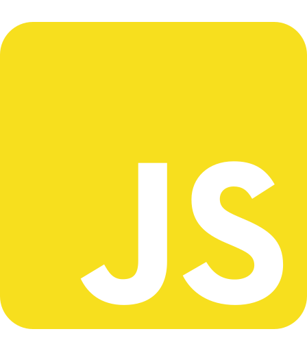

# 💼 Himanshu's Portfolio

<div align="center">
  
  <h3>Full-Stack Developer | Web Designer | AI/ML Enthusiast</h3>
  
  [](https://portfolio-2-0-himanshu.vercel.app/)
  [](https://github.com/him4n-shu/portfolio-2.0)
  [](https://www.linkedin.com/in/himanshu-kumar-b4b799208)
</div>

## ✨ Features

- **Modern Design** - Clean, responsive interface with smooth animations
- **Interactive Elements** - Engaging user experience with Framer Motion animations
- **Project Showcase** - Detailed project cards with live demos and source code links
- **Skill Visualization** - Interactive 3D tag cloud showcasing technical skills
- **Contact Form** - Direct email communication with EmailJS integration
- **Smooth Transitions** - Seamless page transitions between sections
- **Resume Download** - Easy access to resume for recruiters
- **Mobile Responsive** - Optimized for all device sizes

## 🛠️ Built With

<div align="center">
  
  
  
  
  
</div>

- **Next.js** - React framework for production
- **React** - Frontend library
- **JavaScript** - Programming language
- **Tailwind CSS** - Utility-first CSS framework
- **Framer Motion** - Animation library
- **EmailJS** - Email sending service

## 📋 Project Structure

```
Portfolio 2.0/
├── public/
│   ├── assets/
│   │   ├── fonts/
│   │   ├── icons/
│   │   ├── images/
│   │   └── resume/
│   └── TagCloud.min.js
├── src/
│   └── app/
│       ├── components/
│       │   ├── About.jsx
│       │   ├── Contacts.jsx
│       │   ├── Footer.jsx
│       │   ├── Home.jsx
│       │   ├── Navbar.jsx
│       │   ├── PageTransition.jsx
│       │   ├── Projects.jsx
│       │   ├── Skills.jsx
│       │   ├── SmoothScroll.jsx
│       │   └── SocialSidebar.jsx
│       ├── globals.css
│       ├── layout.js
│       ├── page.js
│       └── styles/
└── package.json
```

## 🚀 Getting Started

### Prerequisites

- Node.js (v14.0.0 or later)
- npm or yarn

### Installation

1. Clone the repository
   ```bash
   git clone https://github.com/him4n-shu/portfolio-2.0.git
   ```

2. Navigate to the project directory
   ```bash
   cd portfolio-2.0
   ```

3. Install dependencies
   ```bash
   npm install
   # or
   yarn install
   ```

4. Run the development server
   ```bash
   npm run dev
   # or
   yarn dev
   ```

5. Open [http://localhost:3000](http://localhost:3000) in your browser

## 📱 Key Sections

### 🏠 Home
Introduction and brief overview with animated elements and a call to action.

### 👨‍💻 About
Personal information, background, and professional journey.

### 🛠️ Skills
Technical skills displayed in an interactive 3D tag cloud and categorized grid.

### 🔧 Projects
Showcase of projects with descriptions, technologies used, and links to live demos and source code.

### 📞 Contact
Contact form for direct communication and social media links.

## 📝 Customization

To customize this portfolio for your own use:

1. Replace personal information in component files
2. Update project details in the `Projects.jsx` file
3. Modify skill sets in the `Skills.jsx` file
4. Replace images in the `public/assets/images/` directory
5. Update resume in the `public/assets/resume/` directory

## 📄 License

This project is open source and available under the [MIT License](LICENSE).

## 🙏 Acknowledgments

- Icons from various sources
- Inspiration from modern portfolio designs
- Special thanks to all open-source contributors

---

<div align="center">
  <p>Designed & Developed with ❤️ by Himanshu Kumar</p>
  <p>© 2025 All Rights Reserved</p>
</div> 